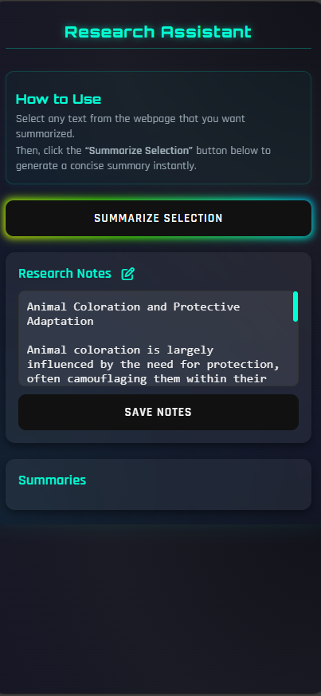
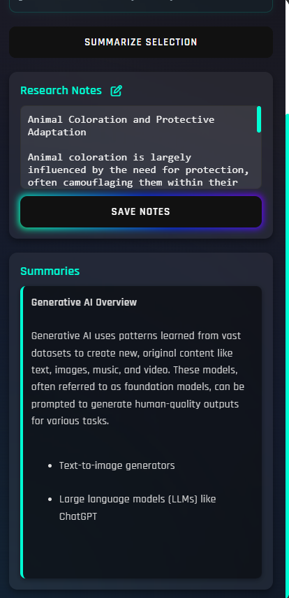

<a href="https://komarev.com/ghpvc/?username=alsiam">
  
</a>


[](https://wakatime.com/@eebb3dd8-d9b2-40de-9b88-6fd6cac99dbc)

<!-- Intro  -->
<h3 align="center">
        <samp>&gt; Hey There!, I am
                <b><a target="_blank" href="https://alsiam.com">Anurag Komrewar</a></b>
        </samp>
</h3>


<p align="center"> 
  <samp>
    <a href="https://anuragkom.github.io/portfolio/">「 Google Me 」</a>
    <br>
    「 I am a full stack software developer 」
    <br>
    <br>
  </samp>
</p>
<p align="center">
 <a href="" target="blank">
  
 </a>
 <a href="" target="_blank">
  
 </a>
 <a href="" target="_blank">
  
 </a>
 <a href="" target="_blank">
  
 </a>
 <a href="" target="_blank">
  
 </a> 
 <a href="" target="_blank">
  
  </a> 
</p>
<br />

<!-- About Section -->
 # About me
 
<p>
 
  
 ✌️ &emsp; Enjoy to do programming and sharing knowledge <br/><br/>
 ❤️ &emsp; Love to writing code and learning new features<br/><br/>
 📧 &emsp; Reach me anytime: askomrewar@gmail.com<br/><br/>
 <!--💬 &emsp; Ask me about anything [here](https://github.com/alsiam/alsiam/issues)-->
</p>

<br/>

## Tech Stack Used To Code

[](#)


 


[](#)
[](#)


# <h1 align = "center">Your Smart AI Research Assistant</h1>
### <h3 align= "center">Made using Google gemini AI model</h1>
<!-- ABOUT THE PROJECT -->
## About The Project
This project is a powerful, AI-assisted research and content generation system designed to make understanding and summarizing complex information effortless.
It brings together backend intelligence, modular extensions, and smart automation to help users analyze large data sets, extract key insights, and produce structured outputs instantly.

With a focus on speed, accuracy, and simplicity, the system combines modern development practices, scalable architecture, and seamless integration with AI models to transform how teams collaborate, learn, and produce meaningful results.
<!-- DEMO-->
## Demo
<div>
  <p>
  Here's a short demo of the <b>Research Assistant</b> an AI powered helper tool.
</p>
  
<p align="center">
  
</p>
<p align="center">
 &nbsp;  &nbsp; 
</p>
</div>

<!-- Features-->
## Features
<div>
<p>🔍 AI-Powered Summarization — Reads and summarizes long or technical content into concise, well-formatted sections automatically.</p>
<p>⚡ Smart Content Analysis — Identifies key ideas, patterns, and actionable insights using intelligent algorithms.</p>
<p>🧩 Modular Architecture — Built for easy extension; plug in new AI models, APIs, or processing modules effortlessly.</p>
<p>🛠️ RESTful Backend — Offers clean and standardized APIs for integration with web, mobile, or external systems.</p>
<p>🧠 Context-Aware Suggestions — Provides recommendations or content improvements based on prior inputs.</p>
<p>🧰 Developer Friendly — Uses best practices like clean code structure, dependency injection, and centralized error handling.</p>
<p>🔒 Secure and Scalable — Implements validation, masking, and sanitization for sensitive data; optimized for performance.</p>
</div>

<!-- setup-->
### Setup

#### Prerequisite
- Java 17+
- Maven 3.8+
- Spring Boot (already configured in the project)
- Google Gemini AI Model API
- (Optional) Docker – for containerized deployment

<!-- INSTALLATION -->
## Installation

1. Clone the repository:
   ```sh
   git clone https://github.com/AnuragKom/ResearchAssistant.git

2. Navigate and Build the project:
   ```sh
   mvn clean install

3. Run the project:
   ```sh
   mvn spring-boot:run

4. Clone the extension repository:
   ```sh
   git clone https://github.com/AnuragKom/ResearchAssistantExtension.git
4. Add extension to your browser
5. Ready to go!
<!-- LICENSE -->
## License

MIT License

This project is licensed under the terms of the MIT License.
You can find a copy of the license in the LICENSE file or visit
https://opensource.org/licenses/MIT.

© [2023] [Anurag Komrewar]
<p align="right">(<a href="#readme-top">back to top</a>)</p>

<!-- CONTACT -->
## Contact

Your Name - askomrewar@gmail.com

<p align="right">(<a href="#readme-top">back to top</a>)</p>


<!-- ACKNOWLEDGMENTS -->
## Acknowledgments

I would like to express my gratitude to the following individuals and resources that have contributed to the development of this project:

* [GitHub Pages](https://pages.github.com)
* [Font Awesome](https://fontawesome.com)
* [React Icons](https://react-icons.github.io/react-icons/search)

<p align="right">(<a href="#readme-top">back to top</a>)</p>
